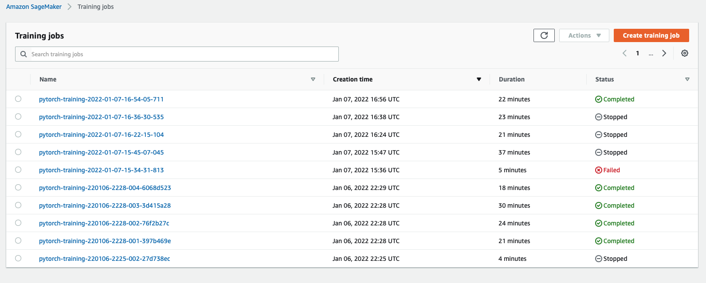
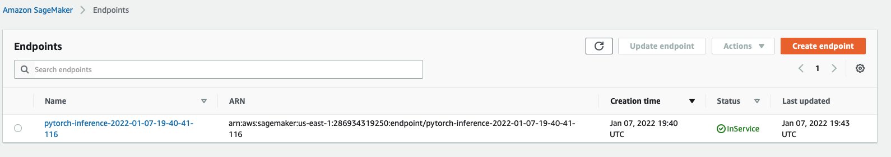

# Image Classification using AWS SageMaker

Use AWS Sagemaker to train a pretrained model that can perform image classification by using the Sagemaker profiling, debugger, hyperparameter tuning and other good ML engineering practices. This can be done on either the provided dog breed classication data set or one of your choice.

## Project Set Up and Installation
Enter AWS through the gateway in the course and open SageMaker Studio. 
Download the starter files.
Download/Make the dataset available. 

## Dataset
The provided dataset is the dogbreed classification dataset which can be found in the classroom.
The project is designed to be dataset independent so if there is a dataset that is more interesting or relevant to your work, you are welcome to use it to complete the project.

### Access
Upload the data to an S3 bucket through the AWS Gateway so that SageMaker has access to the data. 

## Hyperparameter Tuning

The model wich was used for this project was ResNet18 as is the one which is prepared to deal with image identification. 

Here is the list of hyperparameters which have been tuned. They have been chosen according to the instructions given throughout the course and AWS recommendations:

* `lr`
* `epochs`
* `batch-size`

Here is a screen shot with some completed training jobs:



## Debugging and Profiling
**TODO**: Give an overview of how you performed model debugging and profiling in Sagemaker

### Results
**TODO**: What are the results/insights did you get by profiling/debugging your model?

**TODO** Remember to provide the profiler html/pdf file in your submission.


## Model Deployment
To deloy the model, it has been required to create an extra file called `inference.py` which loads the model and transforms the input. 

To call the model, you just have to execute the following lines of code replacing `IMAGE_PATH` by the path where your image is stored and `ENDPOINT` by the name of your endpoint:

```python
import io
import sagemaker
from PIL import Image
from sagemaker.serializers import IdentitySerializer
from sagemaker.pytorch.model import PyTorchPredictor

serializer = IdentitySerializer("image/jpeg")
predictor = PyTorchPredictor(ENDPOINT, serializer=serializer, sagemaker_session=sagemaker.Session())

buffer = io.BytesIO()
Image.open(IMAGE_PATH).save(buffer, format="JPEG")
response = predictor.predict(buffer.getvalue())
```

Here is an image of the endpoint up and running:


